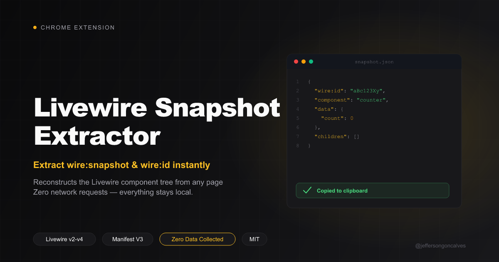

# ⚡ Livewire Snapshot Extractor



Extensão Chrome para extrair snapshots dos componentes Livewire de qualquer página e formatá-los como contexto para o **Claude Code**.

---

## 🚀 Instalação

### Modo Desenvolvedor (sem publicar na Chrome Web Store)

1. Abra o Chrome e acesse `chrome://extensions/`
2. Ative o **Modo do desenvolvedor** (toggle no canto superior direito)
3. Clique em **"Carregar sem compactação"**
4. Selecione a pasta `livewire-snapshot-extractor`
5. A extensão aparecerá na barra de ferramentas ✓

---

## 💡 Como usar

1. Navegue até qualquer página que use **Livewire v2, v3 ou v4**
2. Clique no ícone ⚡ na barra de extensões
3. Os componentes da tela serão extraídos automaticamente
4. Selecione quais componentes quer incluir no contexto
5. Escolha o formato de saída (Markdown, JSON, ou Compact)
6. Clique em **⎘ Copy** para copiar para o clipboard
7. Cole no Claude Code como contexto da tela atual

---

## 📋 Formatos de saída

### Markdown (recomendado para Claude Code)
```markdown
## Livewire Screen Context

> **Page:** Dashboard
> **URL:** `https://app.exemplo.com/dashboard`
> **Livewire:** v3.x | **Components:** 3

### `UserStats`
**ID:** `abc123`
**Route:** `GET /dashboard`

**Properties:**
```json
{
  "totalUsers": 1420,
  "activeToday": 87
}
```
```

### JSON
Saída estruturada completa, ideal para processar programaticamente.

### Compact
Saída mínima para contexto rápido sem muito overhead.

---

## ⚙️ Opções

| Opção | Descrição |
|-------|-----------|
| **Full** | Inclui o snapshot raw completo (útil para debug profundo) |
| **All / None** | Seleciona/deseleciona todos os componentes |
| Checkbox por componente | Escolha exatamente quais componentes incluir |

---

## 🔧 Compatibilidade

| Versão Livewire | Suporte |
|-----------------|---------|
| Livewire 4.x    | ✅ Full (via `wire:snapshot`) |
| Livewire 3.x    | ✅ Full (via `wire:snapshot`) |
| Livewire 2.x    | ✅ Parcial (via `wire:initial-data`) |

---

## 📁 Estrutura do projeto

```
livewire-snapshot-extractor/
├── manifest.json          # Configuração MV3
├── popup.html             # Interface do popup
├── popup.js               # Lógica do popup + formatação
├── src/
│   ├── content.js         # Script injetado na página
│   └── formatter.js       # Utilitário de formatação (referência)
└── icons/
    ├── icon16.png
    ├── icon32.png
    ├── icon48.png
    └── icon128.png
```

---

## 🤖 Exemplo de uso com Claude Code

Após copiar o contexto, adicione no prompt do Claude Code:

```
Aqui está o estado atual dos componentes Livewire na tela:

[cole o contexto copiado]

Com base nisso, [sua pergunta/tarefa aqui]
```

---

## 🛠️ Desenvolvimento

Para modificar a extensão:

1. Edite os arquivos conforme necessário
2. Em `chrome://extensions/`, clique em **↻ Atualizar** na extensão
3. Recarregue a página alvo e teste novamente

---

## 🔒 Privacidade

[Política de Privacidade](https://jeffersongoncalves.github.io/lw-snapshot-extractor/privacy.html) — nenhum dado é coletado, sem requisições de rede, sem rastreamento.

---

Feito com ⚡ para devs TALL Stack
